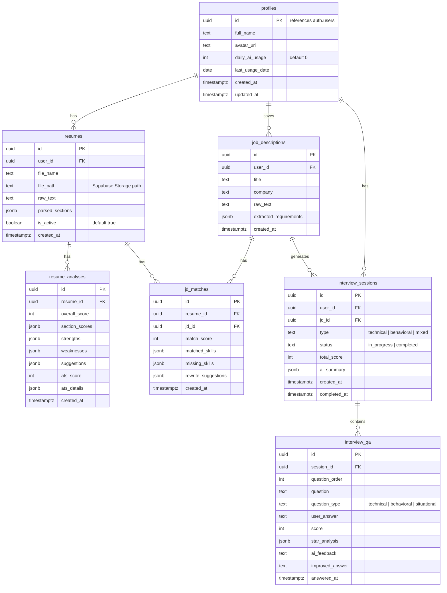

# CV & Interview Coach — Implementation Plan (v2)

## Tổng quan

Xây dựng ứng dụng web AI-powered giúp người tìm việc **phân tích CV**, **so khớp CV với JD**, và **luyện tập phỏng vấn giả lập**. Ứng dụng hướng đến sinh viên mới ra trường và người chuyển ngành tại thị trường Việt Nam.

> [!IMPORTANT]
> **Thay đổi so với v1**: Frontend dùng React (Vite), Backend tách riêng Express.js, Database dùng Supabase, cấu trúc chia rõ `client/` và `server/`.

---

## Tech Stack

| Layer | Technology | Lý do chọn |
|---|---|---|
| **Frontend** | Vite + React 19 + TypeScript | SPA nhanh, DX tốt, tách biệt rõ ràng |
| **Styling** | TailwindCSS v4 + shadcn/ui | Component library chất lượng, dark mode dễ |
| **State** | TanStack Query (React Query) | Quản lý server state, caching, loading states |
| **Routing** | React Router v7 | Client-side routing |
| **Backend** | Express.js + TypeScript | REST API riêng biệt, dễ scale |
| **Database** | Supabase (PostgreSQL) | Hosted PostgreSQL, free tier tốt, có sẵn Auth + Storage |
| **Auth** | Supabase Auth | Google + email/password, JWT tự động |
| **File Storage** | Supabase Storage | Lưu CV uploads, tích hợp sẵn với Supabase |
| **AI** | Anthropic Claude API (claude-sonnet-4-20250514) | Phân tích văn bản, structured output |
| **PDF Parse** | `pdf-parse` + `mammoth` (docx) | Trích xuất text từ CV |
| **Validation** | Zod | Schema validation cả FE và BE |

---

## Cấu trúc thư mục dự án

```
d:\second_project\
├── client/                          # ===== FRONTEND (React + Vite) =====
│   ├── index.html
│   ├── package.json
│   ├── vite.config.ts
│   ├── tsconfig.json
│   ├── tailwind.config.ts
│   ├── public/
│   │   └── assets/
│   └── src/
│       ├── main.tsx                  # Entry point
│       ├── App.tsx                   # Router setup
│       ├── index.css                 # Global styles + Tailwind
│       ├── components/
│       │   ├── ui/                   # shadcn/ui components
│       │   ├── layout/
│       │   │   ├── Sidebar.tsx
│       │   │   ├── Header.tsx
│       │   │   ├── MobileNav.tsx
│       │   │   └── DashboardLayout.tsx
│       │   ├── cv/
│       │   │   ├── CVUploader.tsx
│       │   │   ├── CVAnalysisResult.tsx
│       │   │   ├── ATSScoreCard.tsx
│       │   │   └── SectionFeedback.tsx
│       │   ├── jd/
│       │   │   ├── JDInput.tsx
│       │   │   ├── MatchResult.tsx
│       │   │   └── RewriteSuggestion.tsx
│       │   ├── interview/
│       │   │   ├── QuestionCard.tsx
│       │   │   ├── AnswerInput.tsx
│       │   │   ├── ScoreDisplay.tsx
│       │   │   └── STARAnalysis.tsx
│       │   └── dashboard/
│       │       ├── StatsCards.tsx
│       │       ├── ProgressChart.tsx
│       │       └── RecentActivity.tsx
│       ├── pages/
│       │   ├── LandingPage.tsx
│       │   ├── LoginPage.tsx
│       │   ├── RegisterPage.tsx
│       │   ├── DashboardPage.tsx
│       │   ├── CVAnalysisPage.tsx
│       │   ├── JDMatchingPage.tsx
│       │   ├── InterviewPage.tsx
│       │   ├── InterviewSessionPage.tsx
│       │   └── HistoryPage.tsx
│       ├── hooks/
│       │   ├── useAuth.ts
│       │   ├── useAIStream.ts
│       │   ├── useCVAnalysis.ts
│       │   └── useInterview.ts
│       ├── services/
│       │   ├── api.ts                # Axios instance + interceptors
│       │   ├── auth.service.ts
│       │   ├── cv.service.ts
│       │   ├── jd.service.ts
│       │   └── interview.service.ts
│       ├── lib/
│       │   └── supabase.ts           # Supabase client (auth only on FE)
│       ├── context/
│       │   └── AuthContext.tsx
│       └── types/
│           └── index.ts
│
├── server/                          # ===== BACKEND (Express + TypeScript) =====
│   ├── package.json
│   ├── tsconfig.json
│   ├── .env.example
│   ├── src/
│   │   ├── index.ts                  # Server entry point
│   │   ├── app.ts                    # Express app setup
│   │   ├── config/
│   │   │   ├── env.ts                # Environment variables
│   │   │   └── supabase.ts           # Supabase admin client
│   │   ├── middleware/
│   │   │   ├── auth.ts               # Verify Supabase JWT
│   │   │   ├── rateLimiter.ts
│   │   │   ├── errorHandler.ts
│   │   │   └── fileValidation.ts
│   │   ├── routes/
│   │   │   ├── index.ts              # Route aggregator
│   │   │   ├── cv.routes.ts
│   │   │   ├── jd.routes.ts
│   │   │   └── interview.routes.ts
│   │   ├── controllers/
│   │   │   ├── cv.controller.ts
│   │   │   ├── jd.controller.ts
│   │   │   └── interview.controller.ts
│   │   ├── services/
│   │   │   ├── cv.service.ts         # Business logic CV
│   │   │   ├── jd.service.ts
│   │   │   ├── interview.service.ts
│   │   │   └── ai.service.ts         # Claude API wrapper
│   │   ├── ai/
│   │   │   ├── client.ts             # Anthropic client setup
│   │   │   ├── prompts/
│   │   │   │   ├── cv-analysis.ts
│   │   │   │   ├── jd-matching.ts
│   │   │   │   ├── interview-questions.ts
│   │   │   │   └── answer-evaluation.ts
│   │   │   └── schemas/
│   │   │       ├── cv-analysis.ts    # Zod schemas cho AI output
│   │   │       └── jd-match.ts
│   │   ├── utils/
│   │   │   ├── pdf-parser.ts
│   │   │   └── helpers.ts
│   │   └── types/
│   │       └── index.ts
│   └── uploads/                      # Temp folder for processing
│
├── shared/                          # ===== SHARED TYPES =====
│   ├── package.json
│   └── types/
│       ├── cv.ts
│       ├── jd.ts
│       ├── interview.ts
│       └── api.ts                    # API request/response types
│
└── docs/
    ├── README-cv-interview-coach.md
    └── README-smart-expense-tracker.md
```

---

## Database (Supabase)

### Tại sao Supabase?
- PostgreSQL hosted miễn phí (500MB, đủ cho project này)
- **Supabase Auth** tích hợp sẵn (Google, email/password) — không cần build auth từ đầu
- **Supabase Storage** cho file uploads (1GB free)
- **Row Level Security (RLS)** — bảo mật data mỗi user tự động
- Dashboard quản lý DB trực quan

### Schema (SQL migrations qua Supabase Dashboard hoặc CLI)



> [!NOTE]
> Bảng `profiles` liên kết 1:1 với `auth.users` của Supabase. Khi user đăng ký qua Supabase Auth, một trigger tự động tạo profile.

---

## API Design (Backend Express)

### Base URL: `http://localhost:3001/api`

| Method | Endpoint | Mô tả |
|---|---|---|
| `POST` | `/cv/upload` | Upload CV file → parse → lưu DB |
| `POST` | `/cv/analyze/:resumeId` | Gọi AI phân tích CV (SSE stream) |
| `GET` | `/cv/analyses/:resumeId` | Lấy lịch sử phân tích |
| `POST` | `/jd` | Lưu JD mới |
| `GET` | `/jd` | Lấy danh sách JD đã lưu |
| `POST` | `/jd/match` | So khớp CV vs JD (SSE stream) |
| `POST` | `/interview/start` | Bắt đầu session, sinh câu hỏi |
| `POST` | `/interview/:sessionId/answer` | Submit câu trả lời + nhận feedback |
| `POST` | `/interview/:sessionId/complete` | Kết thúc session, tổng kết |
| `GET` | `/interview/history` | Lịch sử interview sessions |
| `GET` | `/dashboard/stats` | Stats cho dashboard |

### Auth Flow
```
1. FE: User login qua Supabase Auth (Google/email)
2. FE: Supabase trả về JWT access_token
3. FE: Mỗi request gửi lên BE kèm header: Authorization: Bearer <token>
4. BE: Middleware verify JWT bằng Supabase Admin client
5. BE: Extract user_id từ token, dùng cho queries
```

---

## Cải thiện so với ý tưởng gốc

| # | Tính năng mới | Lý do |
|---|---|---|
| 1 | **ATS Score Simulator** | Cho điểm ATS giả lập giúp user hiểu CV có qua vòng máy không |
| 2 | **CV Rewrite Suggestions** | AI gợi ý viết lại từng bullet point (before/after) |
| 3 | **Interview follow-up questions** | AI hỏi tiếp dựa trên câu trả lời, giống phỏng vấn thật |
| 4 | **STAR Method Analysis** | Chấm câu trả lời theo Situation-Task-Action-Result |
| 5 | **Streaming AI responses** | SSE stream cho UX mượt hơn |
| 6 | **Rate limiting** | Giới hạn AI calls/user/ngày để kiểm soát chi phí |

---

## UI/UX Design Direction

- **Color palette**: Dark mode primary, gradient accents (indigo → violet)
- **Typography**: Inter (body) + JetBrains Mono (scores)
- **Cards**: Glassmorphism với subtle blur backdrop
- **Animations**: Framer Motion cho page transitions, score animations
- **Layout**: Sidebar navigation (collapsible) + main content area

---

## Proposed Changes (5 Phases)

### Phase 1 — Foundation (Tuần 1)

#### [NEW] `client/` — React + Vite setup
- Khởi tạo Vite + React + TypeScript
- Cài TailwindCSS v4, shadcn/ui, React Router, TanStack Query, Framer Motion
- Supabase client config (auth)
- AuthContext + ProtectedRoute
- Landing page, Login page, Register page
- Dashboard layout (Sidebar + Header + MobileNav)

#### [NEW] `server/` — Express.js setup
- Khởi tạo Express + TypeScript (ts-node-dev)
- Supabase Admin client config
- Auth middleware (verify JWT)
- Rate limiter middleware
- Error handler middleware
- CORS config cho frontend
- `.env.example`

#### [NEW] `shared/` — Shared types
- API request/response types
- CV, JD, Interview types dùng chung FE + BE

#### [NEW] Supabase Setup
- Tạo project trên Supabase Dashboard
- Tạo tables theo schema
- Cấu hình RLS policies
- Setup Storage bucket cho CV uploads
- Tạo trigger: on auth.users insert → create profile

---

### Phase 2 — CV Analysis Core (Tuần 2)

#### [NEW] Frontend components
- `CVUploader.tsx`: Drag & drop, file validation (PDF/DOCX, max 5MB)
- `CVAnalysisResult.tsx`: Overall score ring + section cards
- `ATSScoreCard.tsx`: ATS score với breakdown
- `SectionFeedback.tsx`: Expandable feedback per section
- `CVAnalysisPage.tsx`: Trang chính ghép các components

#### [NEW] Backend APIs
- `POST /api/cv/upload`: Nhận file → parse PDF/DOCX → lưu Supabase Storage + DB
- `POST /api/cv/analyze/:resumeId`: Gọi Claude → stream response (SSE)
- `pdf-parser.ts`: PDF/DOCX text extraction
- `cv-analysis.ts` prompt: Structured prompt trả JSON

---

### Phase 3 — JD Matching (Tuần 3)

#### [NEW] Frontend
- `JDInput.tsx`, `MatchResult.tsx`, `RewriteSuggestion.tsx`
- `JDMatchingPage.tsx`: Split view CV/JD + results

#### [NEW] Backend
- `POST /api/jd`: Lưu JD + extract requirements
- `POST /api/jd/match`: So khớp CV vs JD (SSE)

---

### Phase 4 — Mock Interview (Tuần 4)

#### [NEW] Frontend
- `QuestionCard.tsx`, `AnswerInput.tsx`, `ScoreDisplay.tsx`, `STARAnalysis.tsx`
- `InterviewPage.tsx` + `InterviewSessionPage.tsx`

#### [NEW] Backend
- `POST /api/interview/start`: Sinh câu hỏi
- `POST /api/interview/:sessionId/answer`: Chấm điểm + follow-up
- `POST /api/interview/:sessionId/complete`: Tổng kết session

---

### Phase 5 — Dashboard & Polish (Tuần 5)

#### [NEW] Dashboard components + History page
#### Polish: Responsive, loading states, error handling, SEO

---

## Verification Plan

### Automated Tests
```bash
# Backend unit tests
cd server && npm test

# Frontend component tests
cd client && npm test
```

### Manual Verification
- Upload CV → verify parse chính xác
- AI analysis trả đúng JSON, scores hợp lý
- JD matching đúng matching/missing skills
- Interview flow smooth: question → answer → feedback → follow-up
- Auth flow: register → login → protected routes
- Responsive trên mobile/tablet/desktop

### Performance Targets
- Lighthouse score > 90
- AI response first token < 1s (streaming)
- PDF parse < 3s cho file < 5MB
